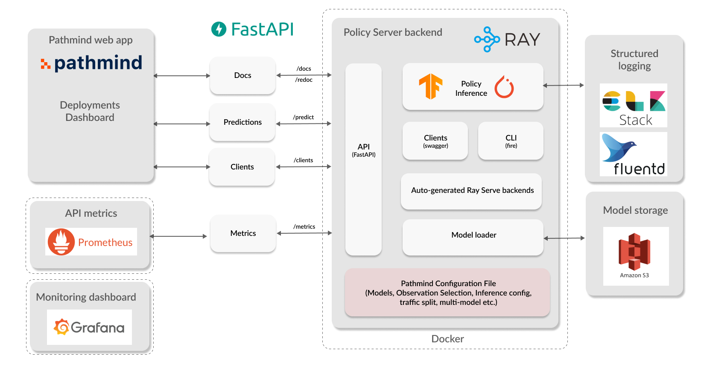

## Overview

Pathmind's policy serving solution. It leverages a open source technologies
to quickly specify and run a lean web applications that serves one or several
reinforcement learning policies.


## How does it work?



The user needs to specify one `schema.yaml` file that describes how an _observation_
looks like for their model. We call this input a schema. Once the schema is provided,
`FastAPI` will generate a `pydantic`-validated, OpenAPI-compliant endpoint for any
`saved_model.zip` model file that takes in observations as specified.

The main work horse is the backend application that you can start locally with `uvicorn app:app`.
This will start a uvicorn server for `FastAPI` which is internally dispatched to a `Ray serve`
handle for predictions.

We leverage Swagger UI to fully describe, validate and test this API. The following endpoints
are exposed on port `8000` (unless stated otherwise): 


- `/predict` To receive model predictions (once the first three endpoints have been used).
- `/clients` To download SDKs in several languages (currently Python, Java, Scala, R).
- `/docs` Get swagger UI classic documentation of the endpoint.
- `/redoc` Get `redoc` documentation for the endpoint.
- `/predict_deterministic` Get the most likely output every time, only works for non-tuple and discrete actions.
- `/distribution` Get the action likelihood distribution for non-tuple and discrete actions.
- `/metrics` This endpoint exposes Prometheus metrics on port `8080`.

The frontend application found at `frontend.py` is a streamlit application that's just
there to demonstrate (very roughly) the application flow, i.e. how to use the backend,
for integration in the Pathmind web app. One noteworthy feature is that the form data
for observation inputs is generated on the fly as well (frontend for backend approach).
We also visualize the action distribution for a given observation, by probing the API,
which is another feature that should make it into the Pathmind app.

Lastly, we also auto-generate a CLI from `generate.py` using Google's `fire` library.

## Install

```bash
virtualenv venv && source venv/bin/activate
pip install -r requirements.txt
```

Also, make sure you have `swagger-codegen` installed on your system, 
following [these instructions](https://swagger.io/docs/open-source-tools/swagger-codegen/).


## Run locally

To run the application, put a TensorFlow SavedModel file called `saved_model.zip` next to `app.py`. Unzip the saved_model.zip in to `./models'.  In
the same location you need to provide a `schema.yaml` file, which schematically looks as follows:

```yaml
observations:
  id:
    type: int
  coordinates_0:
    type: int
  coordinates_1:
    type: int
  has_up_neighbour:
    type: bool
  is_up_free:
    type: bool


parameters:
  discrete: True
  tuple: False
  api_key: "1234567asdfgh"
```

In other words, you need to have `parameters` which tell the policy server whether we're dealing with `discrete`
observations or `tuple`s. Additionally, store the `api_key` in parameters for authentication.

You also need to provide a schema for your `observations` according to what your
model expects. Note that the ordering of the values is of importance, it is used by the policy server to concatenate
the incoming values accordingly. The observation names should correspond to observation selection names in the
web app and the `type`s are mandatory. Valid types correspond to basic numeric Python data types and `List`s
thereof, namely the following:

- `int`
- `float`
- `bool`
- `List[int]`
- `List[float]`

### Running without specifying observations in schema.yaml

If you don't specify the `observations` in the above `schema.yaml`, you can still run policy server, but with
relatively limited functionality. The upside is that your `schema.yaml` is much easier to write, namely as follows:

```yaml
parameters:
  discrete: True
  tuple: False
  api_key: "1234567asdfgh"
```

With this configuration of the policy server, the user will only have access to one predictive endpoint, namely
`predict_raw/`, which requires users to send a JSON with the following structure `{"obs": []}` where the list elements
have to have precisely the right cardinality and ordering. In other words, this endpoint strips all validation that
the other endpoints have, but is quicker to set up due to not having to specify the structure of observations.

### Starting the app

Once you have both `saved_model.zip` and `schema.yaml` ready, you can start the policy server like this:

```commandline
uvicorn app:app
```

To prepare one of the examples that come with this repo, you can e.g. use

```bash
python generate.py copy_server_files examples/lpoc
```

and then start the `uvicorn` application.

## Run frontend (which starts the backend)

Alternatively, you can run a little `streamlit` frontend for demo purposes like so:

```bash
streamlit run frontend.py
```

will start the app on [localhost:8501](localhost:8501) for testing. The application
should be self-explanatory. It leverages the `lpoc` example from the `examples` folder,
but can be used with any other model. Once you hit the `Start the server from schema`
button in the UI, you can also access the backend service directly at 
[localhost:8080](localhost:8000).


## Docker

Build the image with

```bash
 docker build . -t policy_server
 ```

then run the container with

```bash
docker run --shm-size=16GB \
 -p 8000:8000 \
 -p 8080:8080 \
 -p 8256:8256 \
 policy_server
```

For a full production-like setup including all components outlined in the architectural diagram above,
please make use of the `docker-compose.yaml` by running:

```commandline
docker-compose up
```

## Metrics

Metrics get automatically exposed on the metrics port `8080` from Ray Serve and can be scraped
from the `/metrics` endpoint, e.g. from a Prometheus instance. We've provided a minimal `prometheus.yml`
in this repo as a minimal example to start a Prometheus instance locally, and e.g. feeding this
data source into Grafana.

```commandline
prometheus --config.file=./prometheus.yml
```
